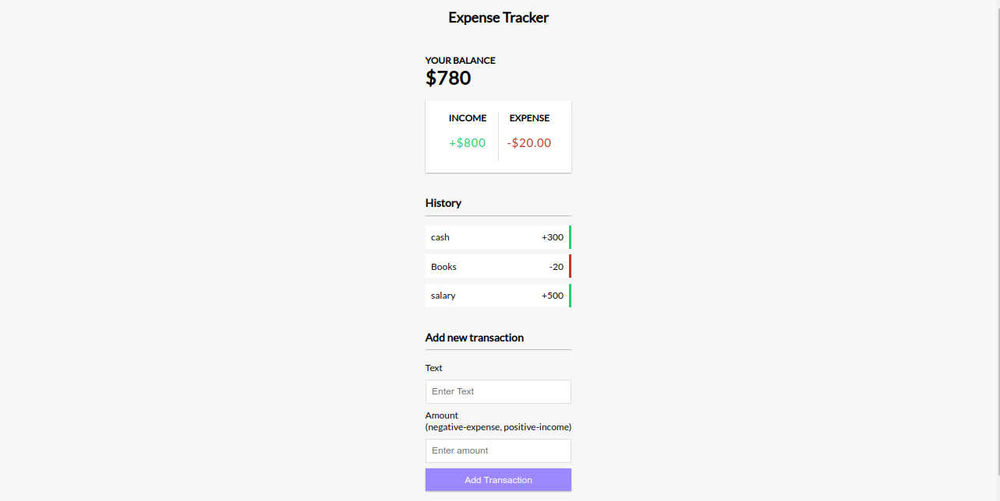

# Expense Tracker App

A simple expense tracker application built with vanilla JavaScript. This app allows users to add, view, and delete expenses, providing a way to manage personal finances.

## Features

- Add new expenses with a description, amount, and date.
- View a list of all expenses.
- Delete individual expenses.
- Store expenses locally using LocalStorage so data persists across sessions.

## Demo

[Link to live demo (if available)](https://expense-tracker-vanilla-4n3nsdoez-ajraneweragmailcoms-projects.vercel.app/)

## Screenshots


 
## Getting Started

Follow these instructions to get a copy of the project up and running on your local machine.

### Prerequisites

You need a web browser to run this application. No additional dependencies are required.

### Installation

1. Clone the repository:

    ```sh
    git clone https://github.com/moslemajra85/expense-tracker-app.git
    ```

2. Navigate to the project directory:

    ```sh
    cd expense-tracker
    ```

3. Open the `index.html` file in your web browser to run the application.

## Usage

1. Open the app in your web browser.
2. Add a new expense by entering the description and amount, then click the "Add Expense" button.
3. View your list of expenses.
4. Delete an expense by clicking the delete button next to the corresponding expense.

## Code Structure

- `index.html` - The main HTML file that contains the structure of the app.
- `style.css` - The CSS file that contains the styles for the app.
- `script.js` - The JavaScript file that contains the functionality of the app.

## Contributing

Contributions are welcome! Please fork the repository and create a pull request with your changes.

1. Fork the repository.
2. Create a new branch: `git checkout -b my-feature-branch`.
3. Make your changes and commit them: `git commit -m 'Add new feature'`.
4. Push to the branch: `git push origin my-feature-branch`.
5. Open a pull request.

## License

This project is licensed under the MIT License - see the [LICENSE](LICENSE) file for details.

## Acknowledgments

 - Inspiration: Brad Traversy Javascript Course


 